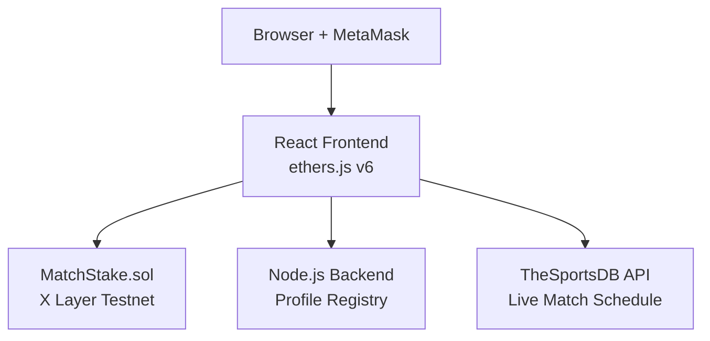
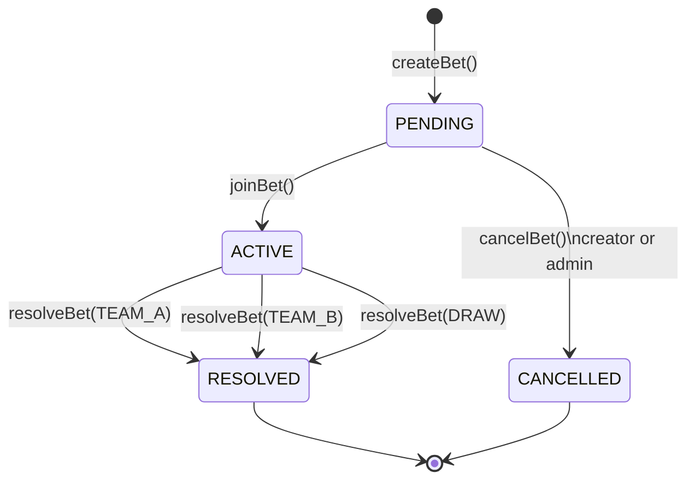
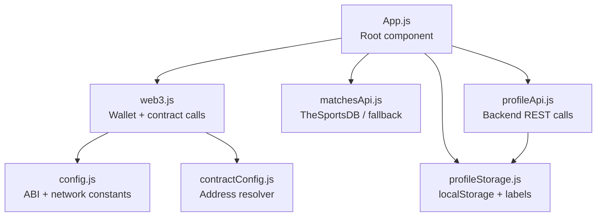
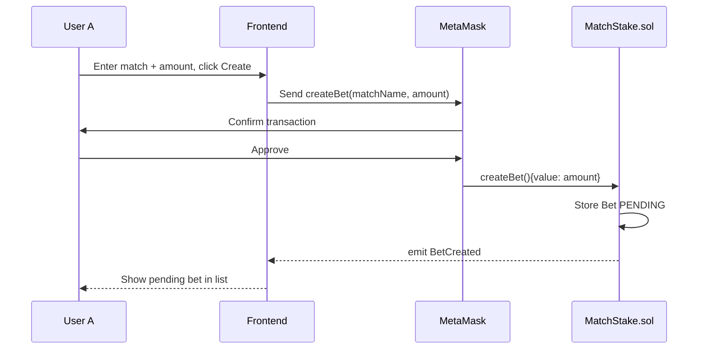
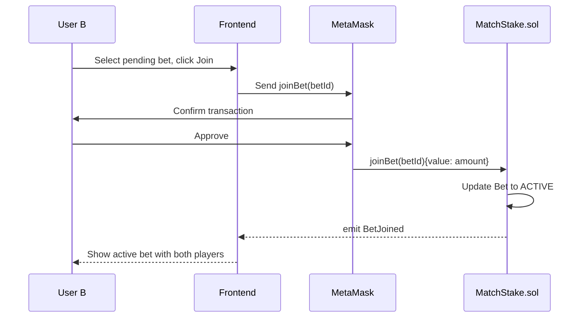
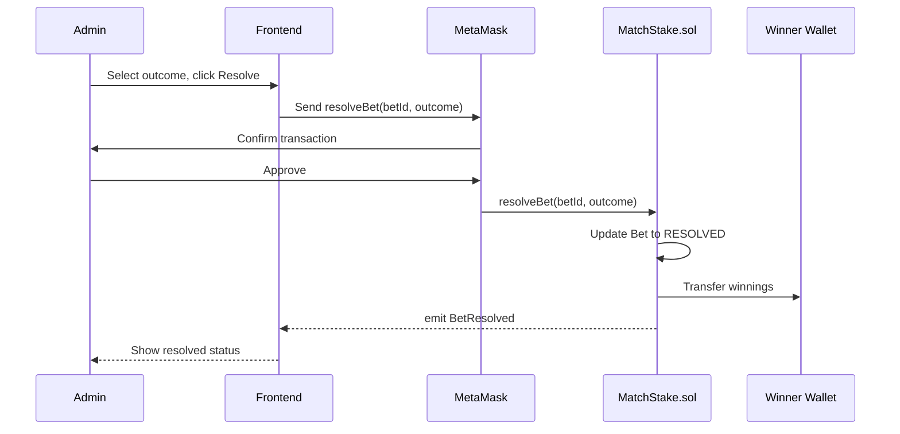
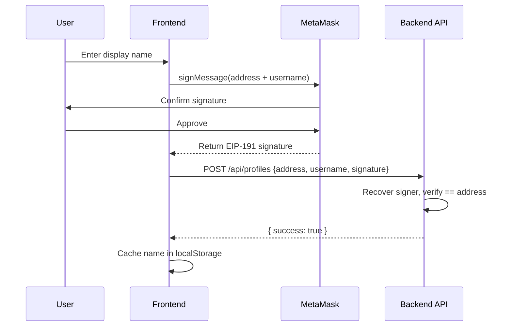

# MatchStake — Technical Architecture

## System Overview

Four components work together to deliver the full MatchStake experience:



---

## Smart Contract Architecture

### Bet State Machine



### Storage Layout

| Variable | Type | Description |
|----------|------|-------------|
| `bets` | `mapping(uint256 => Bet)` | All bets indexed by ID |
| `nextBetId` | `uint256` | Auto-incrementing ID counter |
| `admin` | `address` | Address authorised to resolve bets |
| `totalBets` | `uint256` | Lifetime bet count |

### `Bet` Struct

| Field | Type | Description |
|-------|------|-------------|
| `betId` | `uint256` | Unique identifier |
| `matchName` | `string` | Human-readable label (e.g. "Brazil vs France") |
| `teamABetter` | `address` | Bet creator — backs Team A |
| `teamBBetter` | `address` | Bet joiner — backs Team B |
| `amount` | `uint256` | Stake per player (wei) |
| `status` | `BetStatus` | `PENDING` / `ACTIVE` / `RESOLVED` / `CANCELLED` |
| `outcome` | `Outcome` | `PENDING` / `TEAM_A` / `TEAM_B` / `DRAW` |
| `createdAt` | `uint256` | Block timestamp of creation |
| `resolvedAt` | `uint256` | Block timestamp of resolution |

---

## Frontend Architecture

### Module Map



### Module Responsibilities

| Module | Responsibility |
|--------|----------------|
| `web3.js` | Wallet connection, network switching, contract method calls, event listeners |
| `config.js` | Contract ABI, chain ID, RPC URL, explorer base URL |
| `contractConfig.js` | Resolves contract address from three priority sources (see below) |
| `matchesApi.js` | Fetches upcoming fixtures from TheSportsDB; returns curated fallback list when offline |
| `profileApi.js` | Registers and fetches display names via the backend REST API |
| `profileStorage.js` | Persists known names in `localStorage`; generates stable anonymous labels for unknown wallets |

### Contract Address Resolution Priority

`contractConfig.js` tries sources in order and stops at the first valid EVM address:

```
1. /contract-address.json  (served from React public/ after sync-contract-address.js runs)
2. GET {API_URL}/api/config (backend endpoint)
3. REACT_APP_CONTRACT_ADDRESS environment variable
```

---

## Data Flows

### Create Bet



### Join Bet



### Resolve Bet



### Profile Registration



---

## Backend Architecture

The Node.js backend (`backend/server.js`) is a lightweight Express server providing two capabilities:

| Method | Endpoint | Description |
|--------|----------|-------------|
| `GET` | `/api/profiles` | Returns all registered `address → username` mappings |
| `POST` | `/api/profiles` | Registers a new mapping (requires EIP-191 signature) |
| `GET` | `/api/config` | Returns `contractAddress` and `chainId` for the frontend |

Persistent state is stored in `backend/data/profiles.json` and `backend/data/contract-address.json`.

---

## Design Decisions

### Why Admin-Resolved Outcomes?

Chainlink oracles add complexity and cost on testnet. An admin-resolved model is simpler, fully transparent via events, and sufficient for a World Cup demo. The `setAdmin()` function allows migrating the admin role to a Gnosis Safe multisig for a production deployment.

### Why P2P Instead of a Pool?

P2P matching is fairer (exact stake symmetry between two opposing bettors) and avoids liquidity management complexity. It is also easier to reason about in an audit context.

### Why X Layer Testnet?

X Layer (OKX's EVM-compatible chain) provides sub-cent fees, fast finality, and an active DeFi ecosystem — ideal for a betting DApp requiring multiple on-chain interactions per session.

### Why ethers.js v6?

v6 ships with better TypeScript types and improved tree-shaking. The `BrowserProvider` API integrates cleanly with MetaMask's `window.ethereum`.

---

## Gas Reference

| Operation | Estimated Gas | ~OKB at 1 Gwei |
|-----------|--------------|----------------|
| Deploy | ~800,000 | ~0.0008 OKB |
| `createBet` | ~100,000 | ~0.0001 OKB |
| `joinBet` | ~80,000 | ~0.00008 OKB |
| `resolveBet` | ~120,000 | ~0.00012 OKB |
| `cancelBet` | ~60,000 | ~0.00006 OKB |
